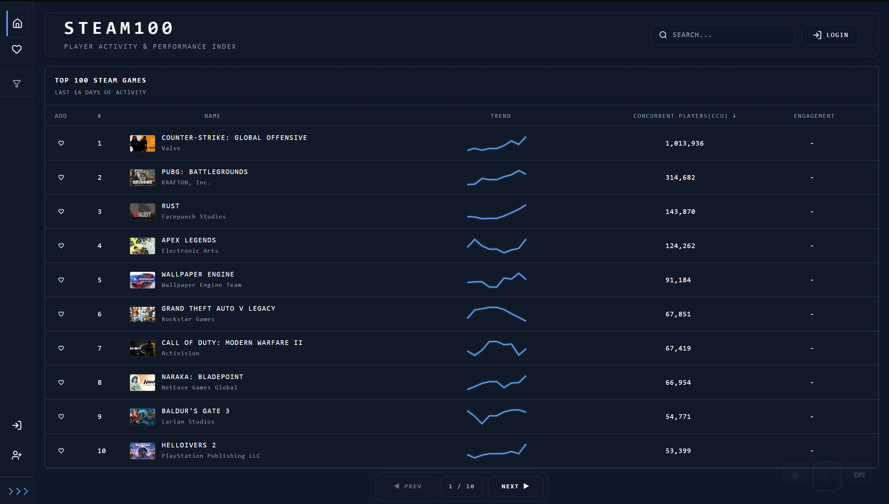

# STEAM100

Full-stack analytics dashboard for tracking the **Top 100 games on Steam** through live activity metrics, historical trend data, and user-driven engagement systems.



---

## Overview

STEAM100 is a data-centric dashboard application built to monitor and visualize the performance of Steam’s most active titles. The platform consolidates key performance indicators into a single interface, enabling users to evaluate market activity, player engagement, and comparative trends.

Core metrics include:

- Concurrent Players (CCU)
- Rolling 14-day activity trends
- Engagement ratios derived from playtime datasets
- Community ratings and recommendations
- Personalized favorites management

The application follows a modern client-server architecture with a dedicated frontend, REST API backend, and persistent database layer.

---

## Key Features

### Analytics Dashboard
- Tracks the Top 100 games on Steam
- Daily refreshed activity data
- Sortable performance metrics
- Search and pagination support

### Trend Visualization
- 14-day historical sparkline trends
- Comparative performance indicators
- Engagement scoring based on average vs median playtime

### Authentication System
- JWT-based authentication
- Google OAuth integration
- Protected user actions
- Persistent login sessions

### User Features
- Favorites management
- Ratings and recommendation voting
- Profile settings and account controls

### UI / UX
- Fully responsive layout
- Dark, Light, and Retro CRT themes
- Custom dashboard interface design
- Data-dense presentation optimized for usability

---

## Screenshots

### Main Dashboard


### Retro Theme


### Game Detail Modal


---

## Tech Stack

### Frontend
- React
- TypeScript
- Vite
- TanStack Query
- Axios

### Backend
- Node.js
- Express.js
- TypeScript

### Database
- MongoDB

### Authentication
- JWT
- Google OAuth 2.0
- Passport.js

### Security / Middleware
- Helmet
- CORS
- Express Rate Limit
- Request Validation Middleware

---

## Architecture

STEAM100 follows a decoupled full-stack architecture:

```text
Frontend (React + Vite)
        ↓
REST API (Express + Node.js)
        ↓
MongoDB Database
```

---

## Live Demo

https://steam-100-dashboard.vercel.app

---

## Local Setup

### Clone Repository

```bash
git clone https://github.com/AdityaYe/steam100-dashboard.git
cd steam100-dashboard
